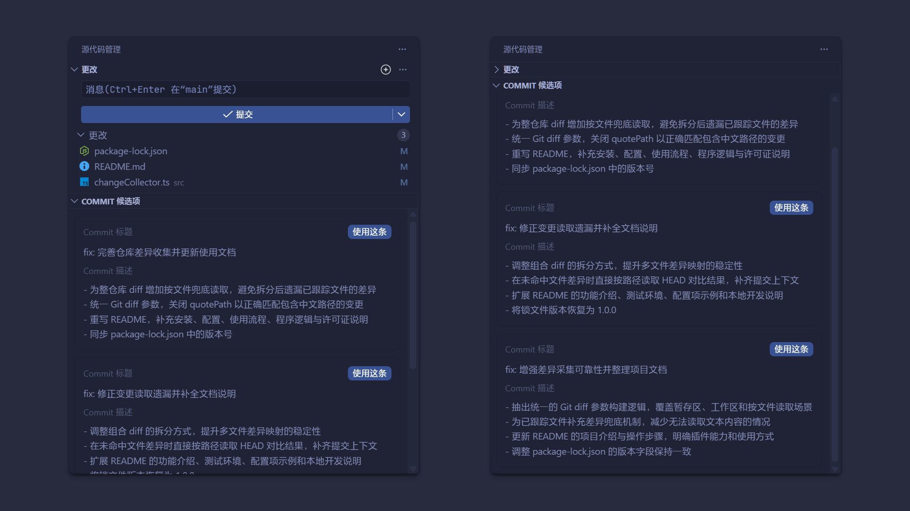

# Comitron



## 简介

这是一个 VS Code 插件，可读取代码变更的差异内容，并调用 AI 生成最恰当的 Commit Message。插件支持通过本地安装的 Claude Code、Codex、Gemini CLI 调用 AI，也支持通过 API 服务进行调用。

## 使用方法

1. 安装本插件。
2. 打开插件设置页面 `@ext:NianBroken.comitron`，配置所用的 AI 工具。
3. 修改代码。
4. 打开 VS Code 的`源代码管理`面板，点击右上角的`AI 生成`按钮。
5. 等待 AI 返回结果。
6. 选择所需的 Commit Message。
7. 插件自动将选中的 Commit Message 填入提交信息输入框。
8. 提交代码。

## 打包

```
npm install
npm run compile
npm run package:vsix
```

## 许可证

`Copyright © 2026 NianBroken. All rights reserved.`

本项目采用 [Apache-2.0](https://www.apache.org/licenses/LICENSE-2.0 "Apache-2.0") 许可证。简而言之，你可以自由使用、修改和分享本项目的代码，但前提是在其衍生作品中必须保留原始许可证和版权信息，并且必须以相同的许可证发布所有修改过的代码。

## 恰饭

[Great-Firewall](https://nianbroken.github.io/Great-Firewall/) 好用的 VPN

[Ciii](https://ciii.klaio.top/) Codex 中转

[Aizex](https://aizex.klaio.top/) ChatGPT 镜像站

以上绝对都是性价比最高的。

## 其他

欢迎提交 `Issues` 和 `Pull requests`
